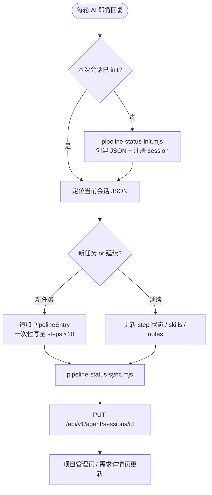

# 月度个人效率先锋奖 — PPT 内容源文档

> **用途**：编辑本 Markdown 后，可据此回写/更新对应 PPT。  
> **源文件**：`月度_个人效率先锋奖_领域_专项名称_软件平台研发部_张聪_118681.pptx`（待复制并重命名）  
> **总页数**：15 页  
> **专项主题**：AICoding 需求与实现过程上报及可视化统计分析（2026.05 – 进行中）

---

## 元信息

| 字段 | 值 |
|------|-----|
| 奖项 | 月度个人效率先锋奖 |
| 部门 | 软件平台研发部 |
| 汇报人（封面） | 张聪 |
| 文件名标注 | 张聪_118681 |
| 汇报日期 | 2026-05-31 |
| 专项周期 | 2026.05 – 进行中 |

> **注意**：封面显示「张聪」，文件名含「张聪_118681」——修改汇报人时请同步更新封面与文件名。

---

## 目录结构（章节分隔页）

PPT 中以下三页为**章节导航页**（仅显示章节编号与标题，无正文）：

- Slide 3 / 6 / 13：`01 专项概述` · `02 专项成果` · `03 专项后续计划`

---

## Slide 1 — 封面

**布局**：封面页（标题 + 部门 + 日期 + 专项周期）

| 元素 | 内容 |
|------|------|
| 部门 / 汇报人 | 软件平台研发部 张聪 |
| 汇报日期 | 2026 05 31 |
| 主标题 | AICoding 需求与实现过程上报及可视化统计分析 |
| 专项周期 | 2026.05 – 进行中 |

**视觉元素**：（模板背景/装饰图形，无额外文本）

---

## Slide 2 — 内文格式规范说明

**布局**：格式规范说明页（模板页，含配色方案示意）

**说明**：此页为 PPT 模板自带的排版规范，一般无需随专项内容修改。若需调整全局字体/配色，在此页维护。

### 字号

- 普通文本：建议 8–14pt
- 重点文本：建议 16–20pt

### 字体

- 普通文本：微软雅黑 Regular
- 重点文本：微软雅黑 Bold

### 行距

- 建议 1–1.5 倍行距

### 注意事项

1. 一般情况下，不建议倾斜字体
2. 内容应不超出四周参考线规定范围

### 文本颜色

- 普通文本：深灰 `#404040`
- 重点文本 1：红色 `#CD0000`
- 重点文本 2：蓝色 `#0070C0`

### 整体配色指导

当需要使用多种颜色时推荐以下组合方案，可用格式刷复制或吸管吸取：

- 方案 1
- 方案 2

**视觉元素**：配色方案色块示意（方案 1 / 方案 2）

---

## Slide 3 — 章节导航（概述）

**布局**：三栏章节导航

| 编号 | 章节 |
|------|------|
| 01 | 专项概述 |
| 02 | 专项成果 |
| 03 | 专项后续计划 |

---

## Slide 4 — 一、专项概述

**布局**：左文 + 右 OKR 表格

### 专项背景及意义

目前团队开发已全面转向 AICoding 工具进行编码开发。一次需求从提问到交付，往往涉及多轮对话、Sub-Agent 委派、Skill 调用、Spec 维护与 Git 提交——但这些过程**只存在于本地会话历史和工作区文件**中。

由此带来三个痛点：

1. **需求完成后无结构化总结**：开发结束即「消失」，无法复盘「用了什么 Agent / Skill、走了哪些阶段、耗时分布如何」
2. **管理者缺乏可见性**：无法按项目 / 仓库 / 分支聚合，不清楚成员是否规范使用 AI 资产（Agent、Skill、MCP）
3. **协作平台数据断层**：人机协作智能体平台已沉淀大量 Agent 资产，但**实际开发过程**并未回流，平台只能展示「有什么」，不能展示「怎么用的」

本专项目标是：在 AICoding 每轮回复前，自动维护本地流水线状态并同步上报至人机协作平台，让开发过程**可追踪、可聚合、可可视化**。

### 整体目标及达成情况

构建一套**零侵入、规则驱动**的开发过程上报机制：

- **开发者侧**：通过 Project Rule + Skill，AI 在每轮回复前自动 init / 更新 / sync，无需手工填表
- **平台侧**：接收 `pipeline-status` JSON，按会话、仓库、流水线、步骤、Skill 多维度展示
- **管理者侧**：可按 Git 仓库 / 分支 / 工号查看团队 AICoding 开发实况与 AI 资产使用情况

### OKR 表格

| 类型 | 整体目标项 | 具体内容/衡量指标 | 计划时间 | 完成时间 | 执行情况（具体指标） | 状态 |
|------|-----------|------------------|----------|----------|---------------------|------|
| 目标（O） | 实现 AICoding 需求与实现过程自动上报及可视化统计分析 | — | 2026 年 5 月 | — | Skill v1.2.0 已发布；Project Rule 已接入；上报 API 联调通过 | 进行中 |
| 子关键成果（KR1） | 本地 pipeline-status 状态文件与 init/sync 脚本 | 会话 init、步骤规划、状态更新、HTTP 同步 | 2026 年 5 月 | 2026 年 5 月 | `pipeline-status-report` Skill 含 init/sync 脚本与协议文档 | 已达成 |
| 子关键成果（KR2） | Project Rule 驱动 AI 每轮自动维护并同步 | alwaysApply 规则 + 花茶通知 MCP | 2026 年 5 月 | 2026 年 5 月 | `agent-info-report` 规则已启用；配合 `huachat-notify` 任务完成通知 | 已达成 |
| 子关键成果（KR3） | 平台端会话 / 流水线 / 步骤可视化展示 | 按仓库聚合、步骤进度、Skill 调用清单 | 2026 年 5–6 月 | — | 平台 PUT API 已对接；前端看板待完善 | 进行中 |

---

## Slide 5 — 一、专项概述 · 整体设计思路图

**布局**：标题 + 设计思路图占位

### 标题

一、专项概述

### 要点

- **交互链路**：用户提问 → CodeBuddy → 主 Agent → 子 Agent / Skill 执行循环 → 结果返回
- **双通道并行上报**：通道一 Pipeline 结构化状态；通道二花茶即时通知（任务完成 / 待确认）
- **通道一本地真值源**：`spec/AI2AI/数据上报/pipeline-status-{hash8}.json`（init → 规划/更新 → sync）
- **通道一同步**：HTTP PUT `/api/v1/agent/sessions/{session_id}`，Header `X-Employee-Id`
- **上报统计展示**：项目管理页（仓库/分支聚合 + 状态统计）+ 需求详情页（首问 / 流水线 / Skill 清单）

### 核心流程（参考 `相关文档/核心上报流程.md`）

```
┌─────────────────────────────────────────────────────────────────────────────┐
│                         Multi-Agent System 信息上报架构                        │
│                    双通道并行上报：结构化状态 + 即时通知                        │
├─────────────────────────────────────────────────────────────────────────────┤
│                                                                              │
│    ┌─────────┐              ┌──────────────┐              ┌──────────────┐  │
│    │  用户   │─── 提问 ────▶│ CodeBuddy    │─── 路由 ────▶│   主 Agent   │  │
│    │ (User)  │              │   编辑器     │              │ Main Agent   │  │
│    │         │◀── 回复 ─────│              │◀── 结果返回 │              │  │
│    └────┬────┘              └──────────────┘              └──────┬───────┘  │
│         │                                                         │         │
│         │                                                         ▼         │
│         │                                              ┌─────────────────┐  │
│         │                                              │   子 Agent /   │  │
│         │           ┌──────────────────────────────────│   Skill 执行    │  │
│         │           │                   Delegation     │   Loop         │  │
│         │           │                                  └────────┬────────┘  │
│         │           │                                           │           │
│         │           ▼                                           │           │
│         │    ┌──────────────┐     ┌──────────────┐              │           │
│         │    │  通道一：     │     │  通道二：     │              │           │
│         │    │ Pipeline 结构 │     │ 花茶即时通知  │              │           │
│         │    │ 化状态上报    │     │ （消息推送）  │              │           │
│         │    └──────┬───────┘     └──────┬───────┘              │           │
│         │           │                     │                     │           │
│         │           ▼                     ▼                     │           │
│    ┌────┴────────────────────────────────────────────────────────┴────┐    │
│    │           需求与实现过程上报统计平台（可视化展示 + 统计分析）          │    │
│    │  ┌──────────────────────────────────────────────────────────┐    │    │
│    │  │  项目管理页（按 Git 仓库/分支聚合）                          │    │    │
│    │  │  ├─ 仓库：yfgitlab.dahuatech.com/.../ebs-web            │    │    │
│    │  │  ├─ 分支：feature/visitor-mgmt                          │    │    │
│    │  │  ├─ 会话列表（session_id / question.title）              │    │    │
│    │  │  └─ 统计：RUNNING 3 | DONE 12 | FAILED 1                │    │    │
│    │  ├──────────────────────────────────────────────────────────┤    │    │
│    │  │  需求详情页（单会话视图）                                  │    │    │
│    │  │  ├─ 首问摘要：【访客管理功能实现】- 冻结展示               │    │    │
│    │  │  ├─ 主 Agent：frontend-requirement-implementation         │    │    │
│    │  │  ├─ 流水线 [0] 访客管理功能实现 (DONE)                    │    │    │
│    │  │  │    ├─ Step 0: fullstack-prd-analysis (DONE)           │    │    │
│    │  │  │    ├─ Step 1: frontend-dev (DONE)                     │    │    │
│    │  │  │    ├─ Step 2: frontend-code-review (DONE)             │    │    │
│    │  │  │    └─ Step 3: frontend-test-case (DONE)               │    │    │
│    │  │  └─ 每步 skills[]：Agent / Skill 调用清单                 │    │    │
│    │  └──────────────────────────────────────────────────────────┘    │    │
│    └─────────────────────────────────────────────────────────────────────┘    │
└─────────────────────────────────────────────────────────────────────────────┘
```

### 通道一：Pipeline 状态上报子流程

每轮 AI 回复前，由 Project Rule 触发 `pipeline-status-report` Skill 执行：



**视觉元素**：

- [ ] 上方 ASCII 架构图导出为 PPT 插图（Slide 5 主图）
- [ ] 通道一子流程 mermaid 导出为补充说明图（可选，放备注或附录）

---

## Slide 6 — 章节导航（成果）

**布局**：三栏章节导航（同 Slide 3）

| 编号 | 章节 |
|------|------|
| 01 | 专项概述 |
| 02 | 专项成果 |
| 03 | 专项后续计划 |

---

## Slide 7 — 二、专项成果 · 本地状态与上报协议

**布局**：成果展示（左说明 + 右 JSON 结构 / 流程截图）

### 标题

二、专项成果 - 成果展示 | 本地状态文件与上报协议

### 组件名称

`pipeline-status-report` Skill（v1.2.0）

### 核心能力

| 能力 | 说明 |
|------|------|
| **初始化** | 新会话创建 `pipeline-status-{hash8}.json`，自动写入 `session_id`、用户首问摘要、`git remote` / 当前分支 |
| **流水线规划** | 每个需求一条 Pipeline；创建时**一次性写全**大步骤（≤10 步），执行中只改 status / notes / skills |
| **Agent / Skill 追踪** | Sub-Agent 步骤自动读取 frontmatter 的 `name` + `skills`；执行中追加自主调用的 Skill |
| **平台同步** | sync 脚本自动补齐版本号、清洗数据，PUT 完整 JSON 到协作平台 |
| **失败重试** | 429/5xx 指数退避最多 5 次；4xx 报错并交给用户手动重试 |

### 上报展示的信息维度

| 展示维度 | 关键字段 |
|---------|---------|
| 会话信息 | `session_id`, `question.title/description`（init 后冻结） |
| Git 仓库 | `repo.git_remote_url`, `repo.git_branch` |
| 主 Agent | `main_agent`（仅 `pipelines[0]` 记录一次） |
| 流水线 | `pipelines[].title`, `overall_status`, `current_step_order` |
| 步骤 | `steps[].step_zh`, `executor_type`, `status`, `skills[]` |
| 同步状态 | `reporting.last_reported_at`, `last_report_error` |

**视觉元素**：

- [ ] `pipeline-status.example.json` 结构截图（脱敏）
- [ ] init / sync 脚本执行终端输出截图

---

## Slide 8 — 二、专项成果 · 规则驱动与通知闭环

**布局**：成果展示（左说明 + 右规则 / MCP 示意图）

### 标题

二、专项成果 - 成果展示 | 规则驱动 + 花茶通知

### 规则层：`agent-info-report`（alwaysApply）

AI 每轮回复前必须完成三件事：

1. **回想是否 init** — 未 init 则新建，已 init 则沿用本次会话文件
2. **判定新任务 or 延续** — 不同需求 / 上条 pipeline 已结束时追加新 PipelineEntry
3. **更新 JSON 并立刻 sync** — 禁止只改本地不同步；禁止修改已冻结的历史条目

### 硬约束（三条不变量）

- `question.title/description` init 后**永久冻结**
- 已结束（DONE/FAILED）的 Pipeline / Step **不可修改**
- `main_agent` 仅写在 `pipelines[0]`，后续 pipeline 不带

### 通知层：`huachat-notify` MCP

| 触发场景 | 通知内容 |
|---------|---------|
| 任务完成 | 总结执行情况（如「成功创建 20 个员工，29 个任务」） |
| 需用户确认 | 说明待选方案 / 待回复事项，引导回到任务界面 |

**视觉元素**：

- [ ] Project Rule 配置截图
- [ ] 花茶通知推送示例截图

---

## Slide 9 — 二、专项成果 · 需求与实现过程可视化及统计分析

**布局**：左机制说明 + 右平台截图 + 下方价值数据

### 标题

二、专项成果 - 需求与实现过程可视化及统计分析

### 平台对接

- **API**：`PUT /api/v1/agent/sessions/{session_id}`，Header `X-Employee-Id`
- **聚合维度**：按 Git 远程仓库 URL → 分支 → 工号 → 会话 → 流水线 → 步骤
- **平台地址**：http://aicoflow.dahuatech.com:5001

### 管理价值

| 之前 | 之后 |
|------|------|
| 开发过程只在本地对话里 | 平台可按项目查看完整流水线进度 |
| 不知道用了哪些 Agent / Skill | 每步 `skills[]` 自动记录，可统计 AI 资产使用率 |
| 需求做完无总结 | 会话级 question + 多条 pipeline 形成结构化交付记录 |
| 管理者无法评估 AICoding 规范度 | 可对比「是否一次性规划 steps、是否及时 sync」 |

### 提效与覆盖（待填实测数据）

| 指标 | 数值 |
|------|------|
| 上报接入项目数 | _待统计_ |
| 日均同步会话数 | _待统计_ |
| 管理者查看覆盖率 | _待统计_ |
| 人工填表时间节省 | 从「无记录」到「全自动」，预计节省 100% 手工汇总 |

**视觉元素**：

- [ ] 协作平台会话列表 / 流水线详情截图
- [ ] 按仓库聚合的项目视图截图

---

## Slide 10 — 二、专项成果 · AI 占比情况

**布局**：标题 + AI 工具使用频率/覆盖 + 工具种类表格

### 标题

二、专项成果 - AI 在个人工作中的占比情况

### AI 工具使用频率

- 日均 AICoding 会话 **多轮次、高频**
- 开发工作 **100%** 通过 AICoding 完成（Spec 驱动 + Agent + Skill）

### 本专项涉及的 AI 资产

| 种类 | 名称 | 场景 |
|------|------|------|
| Skill | `pipeline-status-report` | 本地状态 init/sync 与平台上报 |
| Project Rule | `agent-info-report` | 每轮回复前自动维护流水线状态 |
| Project Rule | `huachat-notify-task-done` | 任务完成 / 待确认时花茶通知 |
| MCP | `send_huachat_notification` | 推送纯文本任务摘要到花茶客户端 |
| 平台 API | `/api/v1/agent/sessions/{id}` | 会话 / 流水线数据落库与展示 |

---

## Slide 11 — 二、专项成果 · 个人优秀成果复制输出

**布局**：多段列表（Skill / Rule / MCP / 文档）

### 标题

二、专项成果 - 个人优秀成果复制输出

### AI 资产输出情况

#### 一、Skill 输出：1 个

- **pipeline-status-report**（v1.2.0）  
  维护本地 `pipeline-status-{hash8}.json`，同步 AI 会话、流水线步骤与执行进度到人机协作平台

#### 二、Project Rule 输出：2 条

| 规则 | 作用 |
|------|------|
| `agent-info-report` | 每轮回复前 init / 规划 / 更新 / sync 流水线状态 |
| `huachat-notify-task-done` | 任务完成或需确认时调用 MCP 发送花茶通知 |

#### 三、协议与流程文档：3 份

| 文档 | 内容 |
|------|------|
| `pipeline-status.protocol.md` | JSON 字段定义、枚举、冻结规则 |
| `核心上报流程.md` | 完整 mermaid 流程图 + 上报信息清单 |
| `agent-info-report&huachat-notify.mdc` | 规则原文与 MCP 调用示例 |

#### 四、可复制推广方式

1. 将 `pipeline-status-report` Skill 安装到目标项目 `.codebuddy/skills/`
2. 复制 `agent-info-report` 与 `huachat-notify` 两条 Project Rule 并启用 `alwaysApply`
3. 在项目根目录 `.env` 配置 `PLATFORM_BASE_URL` 与 `PLATFORM_EMPLOYEE_ID`
4. 创建 `spec/AI2AI/数据上报/` 目录（已在 `.gitignore` 中，不上库）

---

## Slide 12 — 二、专项成果 · 个人对外赋能和分享

**布局**：分享主题列表

### 标题

二、专项成果 - 个人对外赋能和分享

### 分享记录（规划 / 待开展）

| 主题 | 说明 |
|------|------|
| 《AICoding 开发过程自动上报实践》 | 介绍 Skill + Rule + 平台联调完整链路 |
| 《如何让管理者看见 AI 开发过程》 | 面向 PL / 管理者，演示平台可视化 |
| 《pipeline-status 协议与最佳实践》 | 面向研发，讲解 steps 规划规范与常见踩坑 |

**补充**：核心流程文档 1 篇，Skill 协议文档 1 套，待沉淀 Confluence 实践文章

---

## Slide 13 — 章节导航（后续计划）

**布局**：三栏章节导航（同 Slide 3）

| 编号 | 章节 |
|------|------|
| 01 | 专项概述 |
| 02 | 专项成果 |
| 03 | 专项后续计划 |

---

## Slide 14 — 三、专项后续计划

**布局**：后续计划正文 + 资源支撑

### 标题

三、专项后续计划

### 后续计划及行动项

#### 一、平台可视化增强

1. 完善流水线步骤时间线视图（步骤耗时、状态流转动画）
2. 增加「AI 资产使用率」统计看板：Agent / Skill 调用频次、Top N 排行
3. 支持按团队 / 项目维度导出周报

#### 二、上报机制增强

1. 支持多仓库 / monorepo 场景的 `repo` 识别优化
2. 增加 `WAITING_APPROVAL` 状态的审批流对接
3. 离线 sync 队列：网络不可达时本地排队，恢复后自动补传

#### 三、推广与标准化

1. 编写《AICoding 项目接入上报指南》，纳入 `docs/guides/` 培训体系
2. 在 `@网站开发` 等主 Agent 中内置 pipeline 规划模板
3. 推动团队核心项目批量接入，形成管理侧可观测的开发数据基线

### 问题及资源支撑

| 问题 | 需要的支撑 |
|------|-----------|
| 平台前端看板功能尚不完善 | 平台研发团队排期可视化页面 |
| 部分开发者忘记配置 `.env` | 提供 init 脚本友好报错 + 接入 checklist |
| steps 规划质量参差不齐 | 补充 example 与 lint 校验脚本 |

---

## Slide 15 — 结束页

**布局**：结束/致谢页（无文本层）

**视觉元素**：（模板背景/装饰，无可见文本）

---

## 附录：关键技术参考

### 环境配置

```env
# 项目根目录 .env（勿提交 Git）
PLATFORM_BASE_URL=http://aicoflow.dahuatech.com:5001
PLATFORM_EMPLOYEE_ID=<工号>
```

### 常用命令

```bash
# 初始化（新会话，workspace 根目录）
node ./.codebuddy/skills/pipeline-status-report/scripts/pipeline-status-init.mjs

# 同步上报（每次 step 状态变化后立即执行）
node ./.codebuddy/skills/pipeline-status-report/scripts/pipeline-status-sync.mjs \
  spec/AI2AI/数据上报/pipeline-status-{hash8}.json
```

### 相关文档索引

| 文档 | 路径 |
|------|------|
| 核心上报流程 | `相关文档/核心上报流程.md` |
| Skill 完整说明 | `相关文档/pipeline-status-report-skill.md` |
| Project Rule 原文 | `相关文档/agent-info-report&huachat-notify.mdc` |
| AICoding 开发实践 | `docs/guides/AICoding项目开发实践.md` |

---

## 回写 PPT 指引

修改本文档后，可按以下流程更新 PPT（参见 `.codebuddy/skills/pptx/`）：

1. **unpack**：`python scripts/office/unpack.py 月度_...pptx unpacked/`
2. **按 Slide 编号**编辑 `unpacked/ppt/slides/slideN.xml` 中对应文本
3. **clean + pack**：`python scripts/clean.py unpacked/` → `python scripts/office/pack.py unpacked/ output.pptx --original 月度_...pptx`
4. **QA**：`python -m markitdown output.pptx` 核对文本；必要时用 thumbnail / PDF 做视觉检查

### 编辑建议

- 仅改**文字内容**时：优先改 Slide 1、4–5、7–12、14
- Slide 2 为模板规范页，通常保持不变
- Slide 3/6/13 为章节导航，改章节标题时三处保持一致
- Slide 5/7/8/9 含**架构图 / 截图**，改文案时需确认图片是否同步替换
- Slide 4 OKR 表格、Slide 9 价值数据、Slide 10 工具表注意单元格内换行与字数，避免溢出
- Slide 9 提效数据目前为占位，接入项目后替换为实测值
